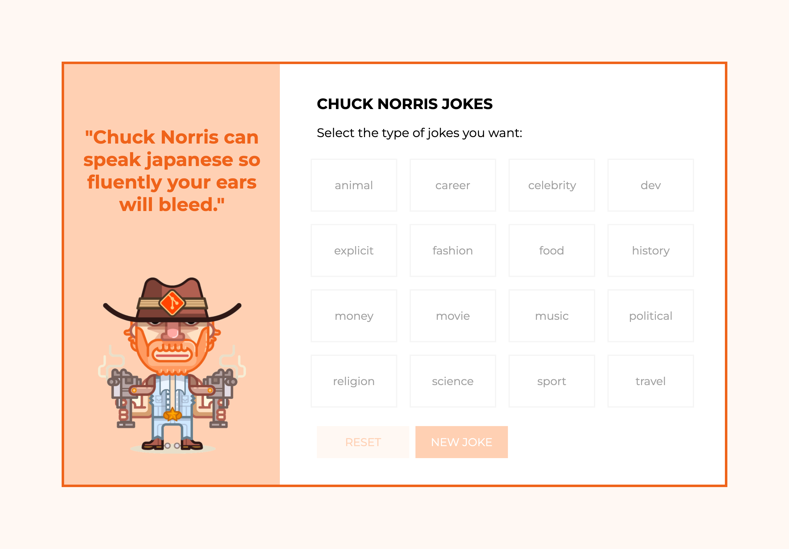
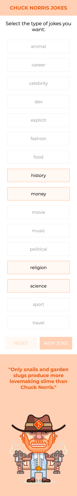
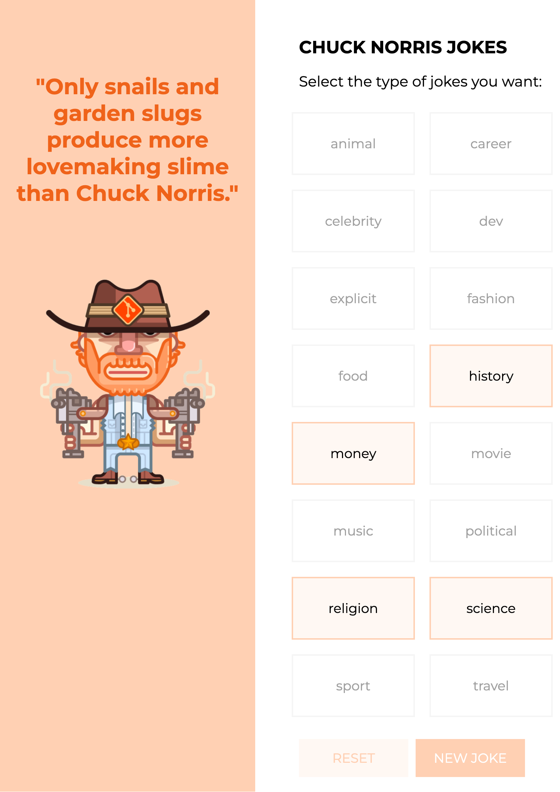
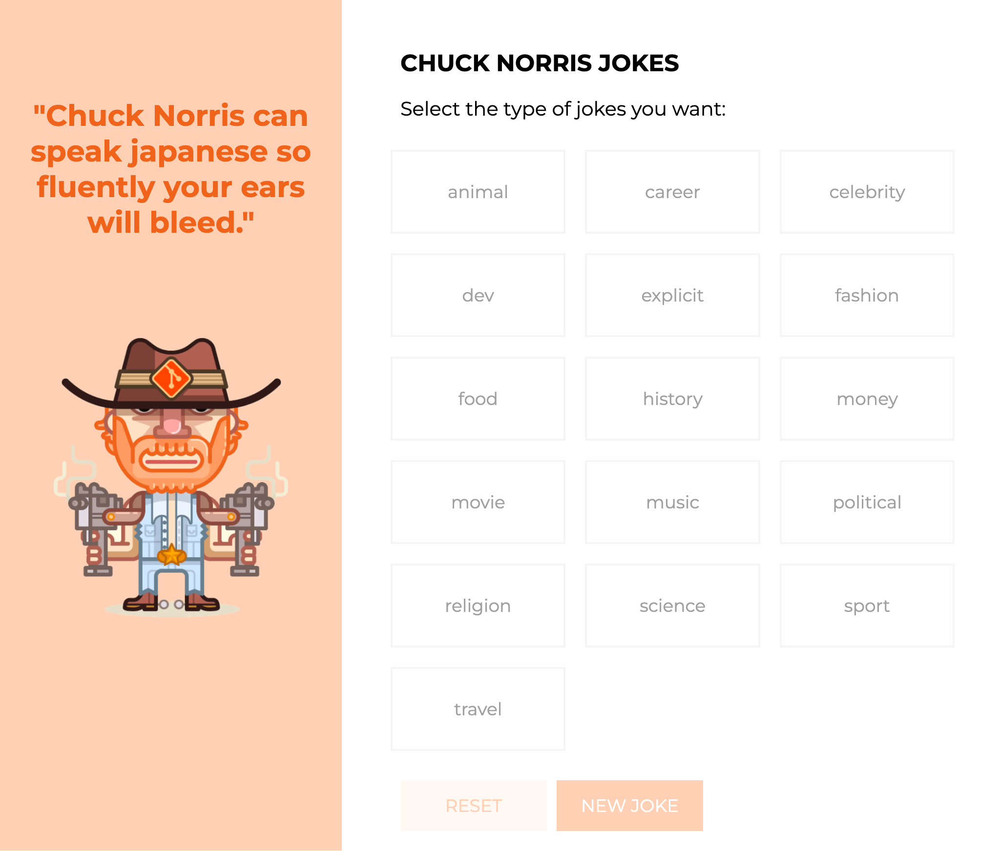
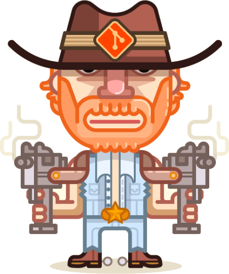

¡Hoy toca enfrentarse a Chuck Norris!




Chuck Norris es tan famoso que tiene una API a la cual podemos lanzar peticiones para recibir chistes:

[https://api.chucknorris.io/](https://api.chucknorris.io/)

La idea, montar una web que muestre el listado de categorías de chistes disponibles, a partir de ahí, el usuario seleccionará las que desee y pulsará para que la web le muestre un chiste random sobre esas categorías.

URL de las llamadas que utilizaremos:

- https://api.chucknorris.io/jokes/categories -> Nos devolverá el listado de categorías de chistes
- https://api.chucknorris.io/jokes/random -> Nos devuelve chiste aleatorio de cualquier categoría
- 'https://api.chucknorris.io/jokes/random?category=food,dev' -> A la última url si le añadimos el parámetro category seguido de un listado separado por comas de las categorías deseadas, nos devuelve un chiste random de alguna de esas categorías.


A nivel de diseño tenemos 4 cortes: mobile (320px-767px), tablet (768px-1023px), desktop-s (1024pxpx-1279px), desktop-m (1280px-...)






Algunas ayudas de diseño ( no hace falta ir al pixel, es más importante la parte de la lógica )
- La sección del chiste a partir de tablet ocupa 350px siempre
- La letra es Montserrat (se puede descargar de google fonts)
- Tamaño de letra de las opciones en todos los tamaños 18px
- Tamaño de letra del título (móvil-20px resto-24px)
- Tamaño de letra de los chistes (móvil-20px resto-30px)
- La imagen de chuck tiene un ancho de 240px siempre




```scss
//Variables
$color1: #EF631A;
$color2: #FFD0B3;
$color3: #FFF8F4;
$color4: #ffffff;
$color5: #000000;
$color6: #A0A0A0;
$color7: #F5F5F5;
```

A por ello!
